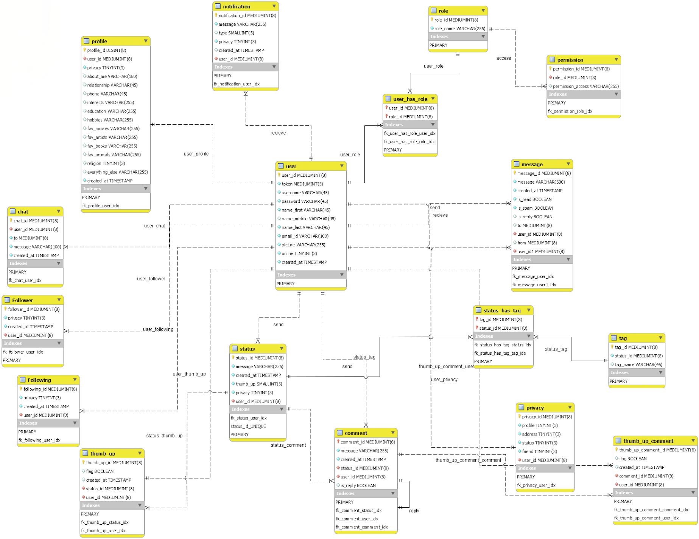

# Design of a Social Network Database

    This is a design of a social network database using MySQL for a social network application. The application has several requirements, e.g.,
    <ul>
        <li> 
            Registering a user
        </li>
        <li> 
            Viewing a list of users who have only followed users who posted at least once a day since
            their registration
        </li>
        <li>
            Viewing the top status (based on the number of likes, comments, likes of comments,
            replies to a comment, replies to the replies of a comment, and likes of the replies)
        </li>
        <li> 
             Viewing most-liked posts which include at least one of the first n trends (popular hashtags)
        </li>
        <li> 
            etc.
        </li>
    </ul>
    All SQL queries for the relevant requirements have been written in '<a href=src/queries.sql>queries.sql</a>'. A simple client '<a href=src/client.java>client.java</a>' has been implemented to connect to the database for sending the queries and receiving the results. The following image shows a snippet of the ER Diagram of the database.

